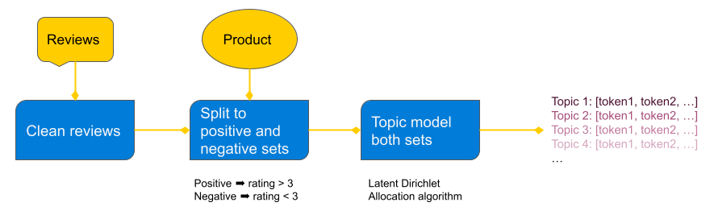
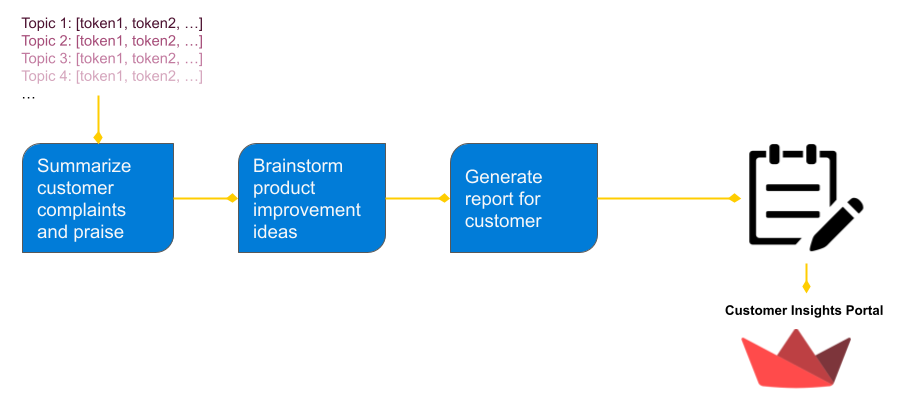
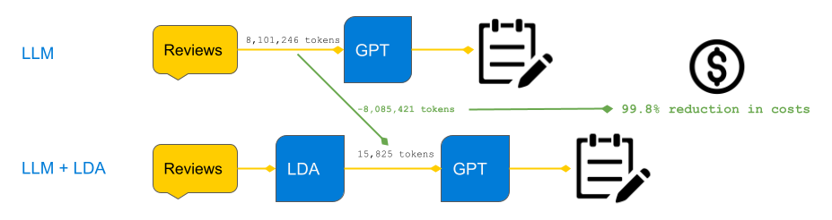

# Analyzing Flipkart Reviews for Product Improvement
> This repo houses the code for a hypothetical AI system that delivers product insights to Flipkart sellers, including key patterns in customer complaints and praise, as well as recommendations to improve the product.

## Dataset
This dataset includes:

- Product’s Name: Contains a total of 104 different products from flipkart.com.
- Price: In Indian Rupees. 
- Rate: Customer rating on a scale of 1 to 5.
- Review: Customer review.
- Summary: A detailed description of the product.

Data was scraped from FlipKart over a three day span. Authors include Mansi Thummar (owner) and Niralii Vaghani (editor).
Mansi Thummar, &amp; Niralii Vaghani. (2023). <i>Flipkart Products Review Dataset</i> [Data set]. Kaggle. https://doi.org/10.34740/KAGGLE/DSV/4901012

## Approach
The general approach is to identify the dominant themes in positive and negative customer reviews for each product and feed the customer complaint patterns into GPT to produce product improvement recommendations. The Latent Dirichlet Allocation (LDA) algorithm is an effective technique for extracting out "topics" from a corpus. I assume negative customer reviews can be distilled into a small set of common complaints that a topic modeling algorithm like LDA can find, and this reduced representation of the corpus can be fed to an LLM model to brainstorm product improvement ideas.

**Why do topic modeling rather than sending GPT all the reviews?**

One might wonder why we can't just send GPT all the reviews and ask it to ideate product improvements? Technically, we can, but data science must consider the costs of scaling such a solution. OpenAI charges on a per-token basis, so sending all reviews would be orders of magnitude more expensive. We can get similar results by collapsing an entire corpus of product reviews into a fixed number of tokens by applying topic modeling beforehand. 

For example, in this application, the number of tokens sent to GPT is just 50 tokens (5 topics and 5 tokens per topic for both positive and negative reviews). In total, there are 8,101,246 tokens in this corpus of product reviews. By applying LDA (10 topics per product, 5 tokens per topic), I reduce this token count to 15,825 tokens! That is a **99.8% reduction in costs**. That's not much for this dataset, but it will be after scaling to all sellers and products on Flipkart, not to mention the added latency of sending GPT all of those tokens.

This is an important demonstration of how data scientists should think about scaling solutions involving LLMs. It's not wise to brute force NLP problems with LLMs when basic preprocessing and token reduction methods prior to the LLM prompts can slash most of the costs and latency in a scaled solution.

## Notebooks
The notebooks demonstrate EDA, cleaning steps, and NLP work.
- [cleaning.ipynb](cleaning.ipynb) - data cleaning
- [topic_modeling.ipynb](topic_modeling.ipynb) - topic modeling and GPT example
- [initial eda](eda.ipynb) - preliminary EDA

## App
The `app/` directory contains code to run the data cleaning, topic modeling, GPT prompt requests, and streamlit app.
- [main](app/main.py) - code to run end-to-end analysis on a given product and generate customer insights report
- [cleaning](app/cleaning.py) - code to clean Flipkart product reviews
- [lda](app/lda.py) - code to run LDA topic modeling
- [gpt_utils](app/gpt_utils.py) - code to communicate with OpenAI GPT models
- [app](app/app.py) - code to run streamlit app

### Demo

## Running Code
**Environment**
- Environment requirements for notebooks and app are in [requirements.txt](./requirements.txt)
- To run any GPT requests, you need to create a `.env` file in the root of the repo and add your OpenAI API key as follows: `API_KEY=<insert OpenAI key>`

**Notebooks**
- Notebooks should run on sample csv's
- Note the csv files contain reviews for one product to reduce the size of data in the git system. The full dataset can be found at the link provided in the Dataset section above

**App**
- You need an OpenAI API key to run the app
- You need to download the complete dataset at the Kaggle link and update the data path in [config.toml](app/config.toml) to point to it
- Navigate to app/ directory in the command line, activate the conda environment, and run `streamlit run app.py`
